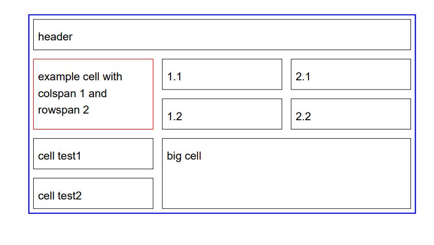

## iText导出PDF

### 概述

iText是著名的开放项目，是用于生成PDF文档的一个java类库。通过iText不仅可以生成PDF或rtf的文档，而且可以将XML、Html文件转化为PDF文件。  代码编写太复杂

如果直接使用iText导出一个较为复杂的PDF的时候，代码量是非常大的，不推荐使用这种方式


依赖：

```xml
 <!--itext 生成PDF 依赖-->
        <dependency>
            <groupId>com.lowagie</groupId>
            <artifactId>itext</artifactId>
            <version>2.1.7</version>
        </dependency>
```


### 实现

段落：

```java
package mao;


import com.itextpdf.text.Document;
import com.itextpdf.text.DocumentException;
import com.itextpdf.text.Paragraph;
import com.itextpdf.text.pdf.PdfWriter;

import java.io.FileNotFoundException;
import java.io.FileOutputStream;

/**
 * Project name(项目名称)：java报表_iText导出PDF
 * Package(包名): mao
 * Class(类名): Test1
 * Author(作者）: mao
 * Author QQ：1296193245
 * GitHub：https://github.com/maomao124/
 * Date(创建日期)： 2023/6/7
 * Time(创建时间)： 21:18
 * Version(版本): 1.0
 * Description(描述)： 无
 */

public class Test1
{
    public static void main(String[] args) throws FileNotFoundException, DocumentException
    {
        //建立Document对象的实例。
        Document document = new Document();
        //建立一个书写器(Writer)与document对象关联，通过书写器(Writer)可以将文档写入到磁盘中。
        PdfWriter.getInstance(document, new FileOutputStream("test.pdf"));
        //打开文档。
        document.open();
        //向文档中添加内容。
        document.add(new Paragraph("Hello World"));
        document.add(new Paragraph("1234567"));
        //关闭文档。
        document.close();
    }
}
```


表格：

```java
package mao;


import com.lowagie.text.*;
import com.lowagie.text.pdf.PdfWriter;

import java.awt.*;
import java.io.FileNotFoundException;
import java.io.FileOutputStream;

/**
 * Project name(项目名称)：java报表_iText导出PDF
 * Package(包名): mao
 * Class(类名): Test2
 * Author(作者）: mao
 * Author QQ：1296193245
 * GitHub：https://github.com/maomao124/
 * Date(创建日期)： 2023/6/7
 * Time(创建时间)： 21:47
 * Version(版本): 1.0
 * Description(描述)： 无
 */

public class Test2
{
    public static void main(String[] args) throws FileNotFoundException, DocumentException
    {
        //建立Document对象的实例。
        Document document = new Document();
        //建立一个书写器(Writer)与document对象关联，通过书写器(Writer)可以将文档写入到磁盘中。
        PdfWriter.getInstance(document, new FileOutputStream("test2.pdf"));
        //打开文档。
        document.open();
        //向文档中添加内容

        Table table = new Table(3);
        table.setBorderWidth(1);
        table.setBorderColor(new Color(0, 0, 255));
        table.setPadding(5);
        table.setSpacing(5);
        Cell cell = new Cell("header");
        cell.setHeader(true);
        cell.setColspan(3);
        table.addCell(cell);
        table.endHeaders();
        cell = new Cell("example cell with colspan 1 and rowspan 2");
        cell.setRowspan(2);
        cell.setBorderColor(new Color(255, 0, 0));
        table.addCell(cell);
        table.addCell("1.1");
        table.addCell("2.1");
        table.addCell("1.2");
        table.addCell("2.2");
        table.addCell("cell test1");
        cell = new Cell("big cell");
        cell.setRowspan(2);
        cell.setColspan(2);
        table.addCell(cell);
        table.addCell("cell test2");

        document.add(table);

        //关闭文档。
        document.close();
    }
}
```





